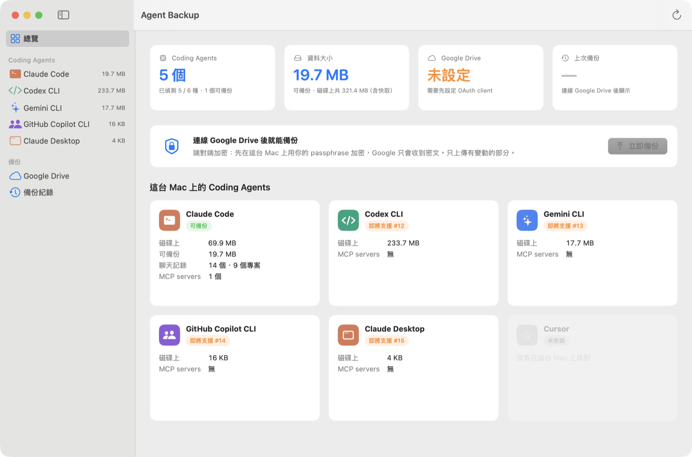

# UI 設計 — Agent Backup for macOS

> 狀態：第一版已實作（2026-10-06）。SwiftUI，macOS 14+，`Sources/AgentBackupApp`。



## 1. 設計原則

- **打開就知道狀態**：啟動時自動掃描 agent、檢查 Google Drive，不需要按任何按鈕。
- **誠實的數字**：同時顯示「可備份」與「磁碟上」大小。例如 Claude Code 磁碟上約 70 MB，但真正需要備份的設定與記錄約 20 MB，其餘是快取與 log。
- **不顯示機密**：MCP 只顯示指令或網址，從不顯示 `env` 與 header 的值。
- **先看再做**：還原一律先顯示計畫（新增 / 更新 / 衝突），使用者確認後才寫入。
- **看得到還不支援的 agent**：已偵測但尚未支援備份的 agent 也會列出，標示「即將支援 #issue」並連到 GitHub。

## 2. 資訊架構

```
┌──────────────┬──────────────────────────────────────────────┐
│ 總覽          │                                              │
│              │   （右側內容依左側選擇切換，可捲動）            │
│ CODING AGENTS│                                              │
│  Claude Code │                                              │
│  Codex CLI   │                                              │
│  Gemini CLI  │                                              │
│  …（只列已安裝）│                                             │
│              │                                              │
│ 備份          │                                              │
│  Google Drive│                                              │
│  備份紀錄     │                                              │
└──────────────┴──────────────────────────────────────────────┘
 工具列：重新掃描（⌘R）
```

## 3. 畫面

### 3.1 總覽（啟動畫面）✅

```
┌ Coding Agents ┐┌ 資料大小 ─────┐┌ Google Drive ┐┌ 上次備份 ──────┐
│ 5 個           ││ 19.7 MB       ││ 已連線        ││ 2 小時前        │
│ 已偵測 5/6 種   ││ 磁碟上共 321MB ││ me@gmail.com ││ MacBook Air·3份 │
└───────────────┘└───────────────┘└──────────────┘└────────────────┘
┌──────────────────────────────────────────────────────────────┐
│ 🔒 備份 Claude Code 到 Google Drive              [ 立即備份 ] │
│    端對端加密… / 進度條 12/31 個檔案 / 完成：新上傳 3 個…      │
└──────────────────────────────────────────────────────────────┘
這台 Mac 上的 Coding Agents
┌ Claude Code  [可備份] ┐┌ Codex CLI [即將支援 #12] ┐┌ Gemini CLI … ┐
│ 磁碟上 69.9 MB        ││ 磁碟上 233.7 MB          ││              │
│ 可備份 19.7 MB        ││ MCP servers 無           ││              │
│ 聊天記錄 14 個·9 專案  │└──────────────────────────┘└──────────────┘
│ MCP servers 1 個      │  （未安裝的 agent 以淡色顯示）
└───────────────────────┘
```

- 「Google Drive」與「上次備份」卡片可點，分別跳到對應頁面。
- 「上次備份」**不需要 passphrase**：快照 ID 本身含 UTC 時間與裝置名稱（`20261006-143226-MacBook-Air`），直接解析即可。
- Drive 卡片狀態：檢查中 / 未設定 / 未登入 / 已連線（顯示 email）/ 連線失敗。

### 3.2 Agent 詳細頁 ✅

- 標題：圖示、名稱、支援狀態徽章
- 四張統計卡：磁碟上、可備份、聊天記錄（+ 專案數）、MCP servers
- 尚未支援的 agent 顯示「備份還在開發中」與 GitHub issue 連結
- **備份內容**：依類別（聊天記錄、附件、記憶、skills、設定…）的大小比例條
- **MCP servers** 表格：名稱、類型（stdio/http/sse）、範圍（全域 / 專案路徑）、目標
- **檔案位置**：每個路徑旁有「在 Finder 中顯示」

### 3.3 Google Drive ✅

| 狀態 | 顯示 |
|---|---|
| 未設定 | 三步驟說明 + 「選擇 OAuth client JSON…」（NSOpenPanel，預設 Downloads） |
| 未登入 | 「登入 Google」→ 打開系統瀏覽器（loopback + PKCE） |
| 已連線 | 帳號（名稱 / email）、備份份數、加密是否已設定、Google 儲存空間用量條、重新整理、登出 |
| 失敗 | 錯誤訊息 + 重試 |

### 3.4 備份紀錄 ✅

- 依時間排列的快照：日期時間、裝置、相對時間、「最新」徽章
- 每列「還原…」→ 還原精靈（§3.6）
- 「最近的還原」：這台 Mac 的復原點，可一鍵復原最新一次（#11）；Claude Code 執行中時不允許

### 3.5 Passphrase 對話框 ✅

- **第一次**（Drive 上沒有 keyfile）：輸入兩次、至少 8 字元、明確警告「忘記就無法還原」
- **解鎖**（這台 Mac 還沒解鎖過）：輸入一次，錯誤時在對話框內顯示「Wrong passphrase」，成功後存 Keychain
- PBKDF2 在背景執行，不卡 UI

### 3.6 還原精靈 ✅（#9）

需要 passphrase（這台 Mac 沒解鎖過時會先跳出解鎖對話框）。

```
① 選快照          ② 路徑對應              ③ 預覽                    ④ 完成
┌───────────┐   ┌──────────────────┐   ┌──────────────────────┐   ┌─────────────┐
│ ● 最新     │ → │ /Users/alice → ~ │ → │ 新增 29  更新 1  衝突 2 │ → │ 已寫入 30 個 │
│ ○ 10/5    │   │ ~/Documents/x ⚠ │   │ ▸ MCP 'fs' 兩邊不同   │   │ 待辦：       │
│ ○ 10/1    │   │   → [~/Code/x ▾] │   │   (保留本機|用備份|都留)│   │ · claude 登入│
└───────────┘   └──────────────────┘   └──────────────────────┘   │ · 重裝 plugin│
                                                                  └─────────────┘
```

- ① 列出 Drive 上的快照；右側顯示解密後的內容（來源、家目錄、各類別數量與大小）
- ② 預設「舊家目錄 → 新家目錄」；找不到的專案會在 `~/Documents`、`~/Code`、`~/Projects`、`~/Developer` 等處（兩層內）搜尋同名資料夾並自動選用；也可「保留原路徑」或「選擇資料夾…」
- ③ 衝突處理三選一（保留這台 Mac 的 / 用備份覆蓋 / 兩份都留），切換時重新計算；新增 / 更新 / 衝突 / 不變的數量與檔案清單；注意事項（重新安裝 plugin 指令、重新登入）
- 開始還原前偵測正在執行的 agent（#10），只有還原到目前使用者的家目錄時才擋
- ④ 寫入數量、接下來要做的事（可複製的指令）、提醒可在「最近的還原」退回

> 衝突目前是整體一個選項；逐項選擇留待之後。

## 4. 待做畫面


### 4.2 Menu bar ✅（#20）

已實作：上次備份、備份進度、立即備份（⌘B）、每天自動備份開關、打開主視窗。Google Drive 頁另有「自動備份」卡片可選時間。
排程是使用者層級的 LaunchAgent（`~/Library/LaunchAgents/com.kkdai.agent-backup.scheduled.plist`），執行 App 內附的 CLI：`backup --to gdrive --prune --unattended`，log 在 `~/Library/Logs/AgentBackup/scheduled.log`。排程執行絕不跳出輸入框：這台 Mac 必須先解鎖過一次（金鑰在 Keychain），也不會自己建立新的備份位置。

原始設計：

```
☁︎ Agent Backup
  上次備份：2 小時前
  ─────────────
  立即備份      ⌘B
  打開 Agent Backup
  ─────────────
  ✓ 每天自動備份
```

### 4.3 設定（M4）

- 自動備份排程、要備份的類別、保留份數（#5）、更換 passphrase（#4）、鎖定（清除 Keychain 金鑰）

### 3.7 MCP servers ✅（#16）

矩陣：列為 MCP server（依名稱合併）、欄為這台 Mac 已設定的 agent。
- ✅ 已設定、🟠 同名但設定不同、➕ 點一下加入（先確認，顯示轉換警告）
- 寫入走與還原相同的流程：先存復原點，可在「最近的還原」退回；目標 agent 執行中時不寫入
- 轉換：Claude Desktop 只能跑本機 server，遠端的會用 `npx mcp-remote` 包起來；Codex 不支援 SSE；不支援的欄位（如 `cwd`）會提示
- 不顯示 env / header 的值

## 5. 實作結構

```
Sources/AgentBackupApp/
  AgentBackupApp.swift   進入點、主視窗、側欄、路由；--render 截圖模式
  AppModel.swift         @Observable 狀態：agents、Drive 狀態、備份進度、passphrase 流程
  OverviewView.swift     總覽、AgentCard、BackupPanel
  AgentDetailView.swift  Agent 詳細頁
  DriveViews.swift       Google Drive、備份紀錄、最近的還原、Passphrase 對話框
  RestoreWizard.swift    還原精靈（RestoreWizardModel + 四個步驟）
  Components.swift       Card、StatCard、Badge、AgentIcon、格式化、agent 顏色與圖示
```

核心資料來自 `AgentBackupCore`：
- `AgentCatalog.scan(home:)`：偵測 6 種 agent（Claude Code、Codex CLI、Gemini CLI、Copilot CLI、Claude Desktop、Cursor），計算磁碟大小、可備份大小（依類別）、MCP servers
- `GoogleDriveStore.account()`：帳號與儲存空間
- `BackupEngine.parseSnapshotID`：不解密就能顯示上次備份時間
- `BackupEngine.backup(progress:)`：備份進度
- `KeyManager`：與 CLI 共用 Keychain 中的已解鎖金鑰

## 6. 建置與檢視

```sh
scripts/build-app.sh --open          # 打包 build/Agent Backup.app（ad-hoc 簽章）並開啟
swift run AgentBackupApp             # 開發時直接跑（無 .app bundle）

# 不開視窗，把每個畫面（淺色 / 深色）輸出成 PNG，方便 review 或給 AI 看
.build/debug/AgentBackupApp --render /tmp/agent-backup-screens

# 用本機備份資料夾走一遍還原精靈（會真的還原到 <目標 home>，請用測試資料夾）
AGENT_BACKUP_PASSPHRASE=… .build/debug/AgentBackupApp --render-wizard <備份資料夾> <目標 home> /tmp/wizard-screens
```

`--render` 用 `ImageRenderer`，原生按鈕會顯示成黃色佔位符，這是正常的；實際外觀以 App 視窗為準。
